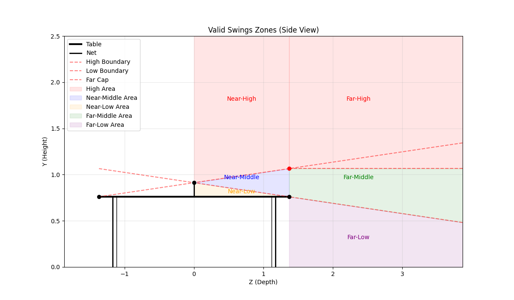

| プレイヤータイプ | 名称 | 移動速度 | 加速度 | スイング選択優先順位 (条件付き) |
| :--- | :--- | :--- | :--- | :--- |
| **Pen Attack** | ペンホルダー速攻型 | 1.2 | 1.3 | **スマッシュ** > ドライブ > ツッツキ |
| **Shake Defence** | シェークハンド守備型 | 1.0| 1.0 | **カット** > ツッツキ > ブロック |
| **Shake Drive** | シェークハンドドライブ型 | 1.0 | 1.0 | **ドライブ** > スマッシュ > ツッツキ |
| **Pen Drive** | ペンホルダー・ドライブ型 | 1.3 | 1.1 | **ドライブ** > スマッシュ > ツッツキ |

## 主な特徴

*   **Pen Attack (ペンホルダー速攻型)**:
    *   高い敏捷性を持ち、攻撃のバランスが良いタイプです。
    *   **スマッシュ**を最優先で狙い、攻撃的なプレーを展開します。

*   **Shake Defence (シェークハンド守備型)**:
    *   守備のスペシャリストです。
    *   **カット（下回転）**を最優先で使用し、相手のミスを誘います。
    *   移動能力は標準的です。

*   **Shake Drive (シェークハンドドライブ型)**:
    *   バランスの取れた攻撃型です。
    *   **ドライブ（上回転）**を主軸に戦います。
    *   移動能力は標準的です。

*   **Pen Drive (ペンホルダー・ドライブ型)**:
    *   強力な攻撃力を持つスペシャリストです。
    *   最高速度は非常に速いですが、加速力はPen Attackほどではありません。
    *   **ドライブ（ループ）**を最優先で使用し、強力な回転で攻め込みます。

## スイング決定ロジック

AIのスイングは、以下の2段階のプロセスで決定されます。

### 1. 物理的な実行可能性の判定 (Valid Swings)
ボールの位置、高さ、速度に基づいて、物理的に打球可能なスイングの種類（候補）を特定します。これは**全プレイヤータイプ共通**のロジックです。

*   **High Area**: スマッシュ、ドライブ
*   **Near Low Area**: ツッツキ、Normal
*   **Near Middle Area**: ツッツキ、ドライブ、Normal
*   **Far Middle Area**: カット、ドライブ、Normal、スマッシュ
*   **Far Low Area**: カット、ドライブ、Normal

### 2. 優先順位による選択 (Deterministic Selection)
特定された候補の中から、**プレイヤータイプごとの優先順位**に従って、最も優先度の高いスイングを選択します。

*   例: **Pen Attack** の場合
    1.  候補に **スマッシュ** があれば、即座に選択。
    2.  なければ、候補に **ドライブ** があれば選択。
    3.  それもなければ、**ツッツキ** を選択。

このロジックにより、各プレイヤータイプは自身の得意な戦術を最大限に活かす行動をとります。
